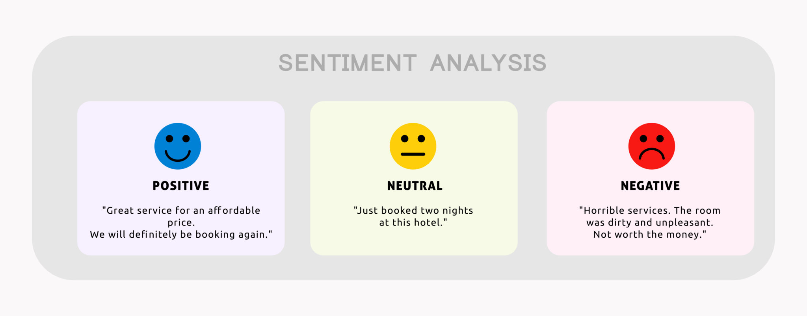

# dighum101-covid19-hashtag-sentiment-analysis

## Abstract

This project, titled "**A Sentiment Analysis on Trending Hashtags and Its Related Content during the COVID-19 Pandemic**," aims to analyze the sentiment of public health messages on TikTok during the COVID-19 pandemic. Over the past decade, social media has become an increasingly widespread medium, emerging as a prevalent and effective communication tool, and has thus shown how crucial it is for disseminating public health information. During the COVID-19 pandemic, social media platforms like TikTok became vital for sharing public health messages that reached diverse audiences with varying demographics.

The primary research question of this project is: “What do trending hashtags on TikTok reveal about public sentiment towards public health messages during the COVID-19 pandemic?” To address this, the project will utilize data collection, text processing, and sentiment analysis techniques. By using Python and relevant libraries, the project will analyze trending hashtags such as #COVID19, #Pandemic, and #WearAMask, among others, to classify the sentiments of related content as positive, neutral, or negative. The findings aim to provide insights into the emotional impact and response to public health messages on TikTok, offering valuable guidance for improving digital public health communication strategies.
